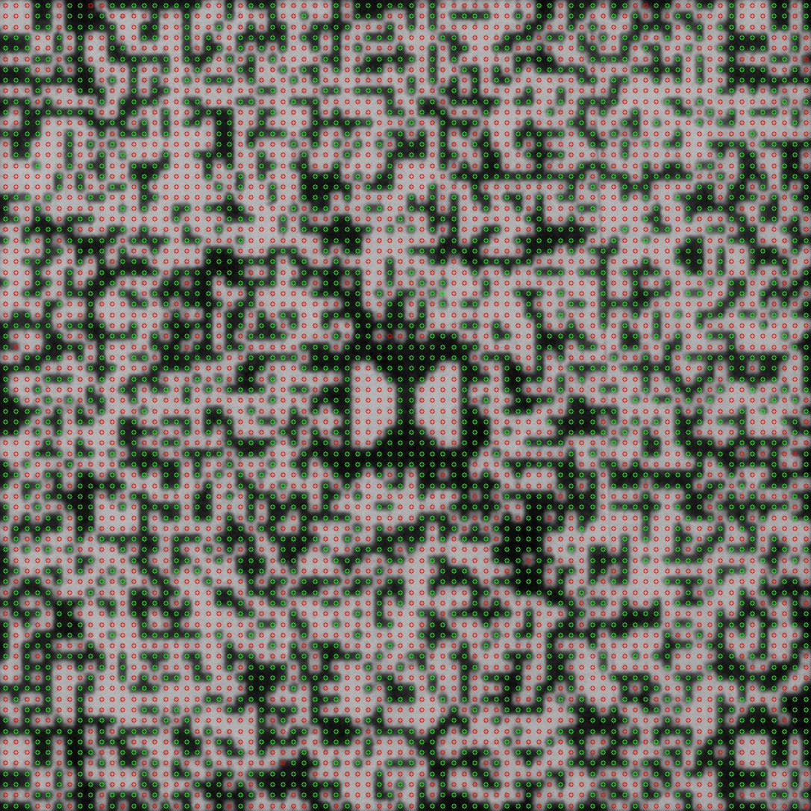

# srd-recognize

A Python3 script to recognize the Dolby SR•D (Dolby Digital) fixel blocks from 35mm film.

<!-- use img tag because we can resize it -->
<!-- markdownlint-disable MD033 -->


This is a **heavily WIP script**, that takes in clear, high resolution images of a SR•D fixel block, and recognizes the black and white fixels. It will also check to see if the known patterns (corner barker codes, middle Dolby logo, and `DOLBY SR*D` ASCII text) were recognized correctly.

Right now it often gets a few fixels incorrect. It can take a keen eye to spot these inaccuracies! This could probably be improved with different thresholding parameters or algorithms, or even some post-recognition image processing, but I have not investigated this yet.

## Usage

Install all the required libraries (`imutils`, `cv2`, `numpy` and `click`) with the following. You may wish to do this inside a virtualenv.

```console
foo@bar:~$ pip install -r requirements.txt
```

Run the script against an image file with:

```console
foo@bar:~$ python dolby_digital_decode.py samples/00000.jpg
```

Which will give the following output, showing the number of correctly identified known markers, the result of the ASCII, and the block and reel number.

```console
420 / 420 correct
ASCII: DOLBY SR*D
Block: 252, reel: 1
Showing recognized pattern, press any key to continue
```

You can add `--grid` to the script to make it show where it detected the grid of fixels to be.

## Thanks

Thanks to [Denis-Carl Robidoux](https://www.deniscarl.com/) for providing the images of the Dolby SR•D fixel blocks.
